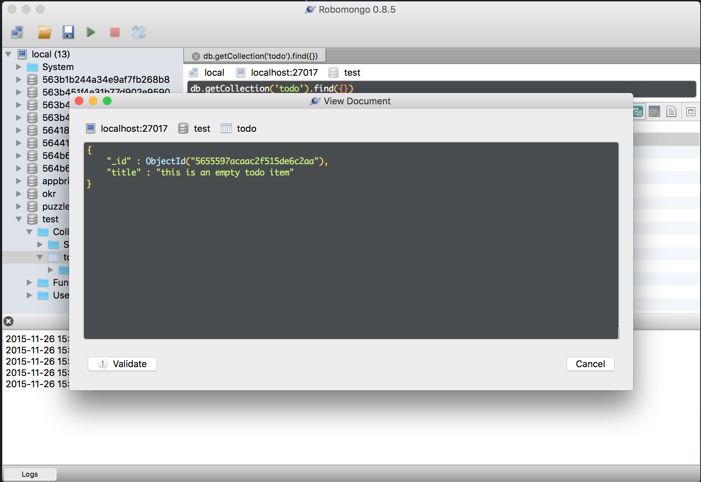
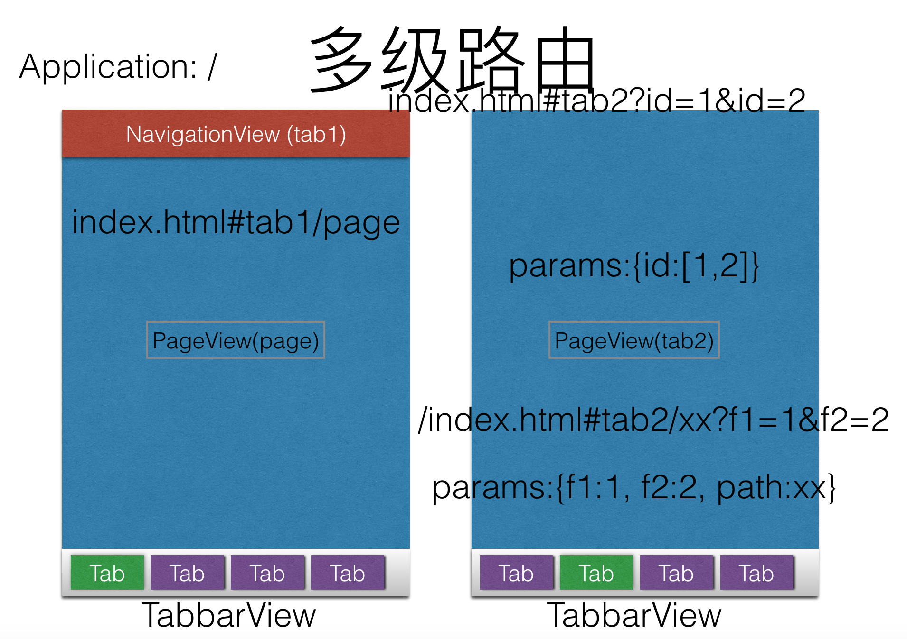

# 开发指南
本指南只介绍本框架部分，对于其依赖的技术，如requirejs，Backbone，jquery等不在此赘述。

## 项目结构
基于此项目开发，在项目目录下有如下的结构，其它部分由框架提供，一般不做直接修改，此项目默认带有多个demo，请参照查看其代码。所有的js代码都是用AMD规范来定义。如todo-demo和static-starter项目，都有如下的目录结构。
<pre>
+- project_dir
  |- app.js
  |+ js
   |+ components
   |+ models
   |+ pages
    |- page.json
    |- page.js
    |- page.html
    |- page.css
  |+ less
  |+ css
  |+ images
</pre>

在app.js中描述了整个应用需要的一些信息，包含应用信息，开发模式，和后台数据的适配（`Backone.Collection`的子类）等，每个页面的配置，逻辑，模板，样式都在`js/pages`目录中。如上的例子：
* page.json - 页面模型，通过给组件配置参数的方式来描述页面的UI元素
* page.js - 页面的后台代码，通常是`PageView`的子类
* page.html - 页面的模板。页面的DOM可以由组件描述或者直接html代码在此文件中描述，在本文件中的优先级高于组件配置。换句话说，如果有此文件存在，UI会按照此模板，而不是组件配置来生成。
* page.css - 此页面的样式。需要注意的是在SPA（单页应用）中样式会影响全局，所以需要在写样式时通过当前页面的id或者class来限定上下文。

值得注意的是以上四个文件不是一定同时需要的，可以只有page.json配置文件。

*注意* 在`static/runtime`中的目录结构和上述的目录结构是一致对应的，但是这是由框架提供和维护更新，应用开发不应修改。在运行时，项目目录的文件和runtime中的文件夹会合并到一起，所以在编写模块，声明依赖时，都认为是在相同目录中即可。

本框架支持灵活的开发模式，基于组件开发或者基于页面模板开发，组件开发可提高重用性，但是需要组件化的思路来思考应用的组成；也可以基于页面模板的方式，那么就是普通的MVC模式，`PageView`只是承担控制器的作用，并不会根据`page.json`的描述来生成组件的UI。

## 使用组件开发
使用组件开发可提高开发效率和代码的重用性，在此框架中已经提供了一部分组件，如果不满足需求的，自行在在`js/components`中开发自己的组件，同名的组件可覆盖框架提供的组件。

组件在页面中使用json配置来定义，他们通过在页面配置的components属性，按照声明顺序进行渲染。如下的页面配置了两个组件`TextView`和`ButtonView`：
```json
{
  "header": {
    "title": "测试应用",
    "items": [{
      "pull": "left",
      "type": "link",
      "icon": "icon icon-plus",
      "href": "#navigate/home"
    }]
  },
  "components" : [
    {
      "type": "TextView",
      "text": "Hello World"
    },
    {
      "id": "btn1",
      "type": "ButtonView",
      "title": "Submit"
    }
  ]
}
```
具体每个组件的可配置项，参考组件的文档`docs/components`。这些文档自动生成，如果自行开发组件，按照注释文档规范，将方便组件文档的同步更新。

组件几个重要的生命周期方法可以覆盖：
* `initialize` - 在组件构造实例的时候调用
* `onRemove` - 在组件被销毁的时候调用

## 视图模板
模板即与页面同名以html结尾的文件，它使用html代码描述了页面的UI。

## 添加处理逻辑
功能的完成，都离不开编写代码。页面的代码文件在和页面同名的js为后缀的文件，它本质上是Backbone.View的子类，PageView作为父类已经处理了大部分通用的逻辑，所以自定义的页面都由PageView派生。PageView也是属于组件的一种，因此它的定义遵守组件的创建和生命周期。对于页面而言，增加了一个生命周期方法：

* `postRoute` - 在路由完成时被调用，这里主要用于处理传递的页面间参数。当参数在页面间传递时，在此方法中，保证所有的参数都被处理并防止在`this.params`变量中。

另外就是补充业务逻辑处理代码,见以下的例子，定义的sayHello方法。

```javascript
define(['./PageView'], function(PageView){
  return PageView.extend({
    initialize: function() {
      // say console
      console.log ("this is a initialize process...");
    },

    sayHello: function() {
      alert("hi");
    }
  });
});
```

## 模拟接口实现
当要开发和后台服务交互的应用时，本框架提供快速生成后台RESTful服务的能力，
同时解决在浏览器中开发调用后台服务的跨域问题，如果需要使用，则在app.js中声明proxy配置。
这里配置了何种形式的url将被拦截到对应的mongodb数据库和表。如下的配置，所有`/api`开始的RESTful服务都被拦截，
映射到MongoDb的test库的对应collection中。比如对`/api/todo`这个资源进行RESTful服务，那么实际操作的就是mongodb的test库todo表。

```
proxy: {
  '/api/*': 'http://localhost:3500/test/*'
},
```
有关mongodb连接信息的设置，默认在项目目录中的`config.json`中配置，默认连接到本机的mongodb。

对于数据的维护，可以使用各种图形化的工具进行维护，推荐使用开源免费的`robomongo`。



## 导航和页面参数传递
本框架对于导航的设计参考了ios应用的设置方式，导航可以进行嵌套，现在有两个导航容器，分别为`TabBarView`和`NavigationView`,它们使用时和PageView的使用相同，比如要声明一个导航页，那么定义一个以页面名称命名的json配置文件。比如如下的定义了一个标签页导航。
```
{
  "id": "mainTabbar",
  "type": "TabBarView",
  "barPosition": "bottom",

  "items": [{
    "label": "首页",
    "href": "#navigate",
    "icon": "icon icon-home"
  }, {
    "label": "待办",
    "href": "#todo",
    "icon": "icon icon-plus"
  }, {
    "label": "关于",
    "href": "#about",
    "icon": "icon icon-person"
  }]
}
```
其中首页所链接的页面实际上不是一个具体的页面，而是另外一个导航页，如下的`NavigationView`, `navigate.json`,
它默认加载home页的内容，其它的页面也通过它加载。
```
{
  "type": "NavigationView",
  "rootPage": "home"
}
```

通过导航的嵌套，每一次嵌套的导航消费一级路径，直到导航到具体的页面，获取参数，最终所有的query参数都被自动解析，放置到页面的`params`变量中，以要保证能够获取页面传递的参数必须在路由完成之后才可用，一般通过覆盖`postRoute`方法。具体的路由和参数解析的过程如下图所示。



## 打包输出
由于整个开发框架的部分资源由运行时产生，如果需要打包到应用或者导出html，js，css等资源，启动开发服务器时，访问`/build`路径即可，对于轻应用模式，选择zip包导出。如果配合了打包服务器，则可直接生成对应平台的app了。
